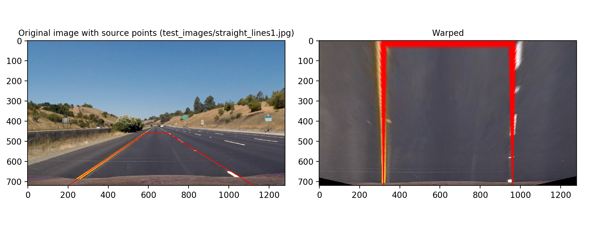

# Advanced Lane Finding Project

The goals / steps of this project are the following:

* Compute the camera calibration matrix and distortion coefficients given a set of chessboard images.
* Apply a distortion correction to raw images.
* Use color transforms, gradients, etc., to create a thresholded binary image.
* Apply a perspective transform to rectify binary image ("birds-eye view").
* Detect lane pixels and fit to find the lane boundary.
* Determine the curvature of the lane and vehicle position with respect to center.
* Warp the detected lane boundaries back onto the original image.
* Output visual display of the lane boundaries and numerical estimation of lane curvature and vehicle position.

## [Rubric](https://review.udacity.com/#!/rubrics/571/view) Points

### Here I will consider the rubric points individually and describe how I addressed each point in my implementation.  

---

### Camera Calibration

The function `calibrate_camera()` in [`calibrate_camera.py`](./calibrate_camera.py) implements this step.

I start by preparing "object points", which will be the (x, y, z) coordinates of the chessboard corners in the world. Here I am assuming the chessboard is fixed on the (x, y) plane at z=0, such that the object points are the same for each calibration image.  Thus, `objp` is just a replicated array of coordinates, and `obj_points` will be appended with a copy of it every time I successfully detect all chessboard corners in an gray-scaled version of the test image.  `img_points` will be appended with the (x, y) pixel position of each of the corners in the image plane with each successful chessboard detection.  

I then used the output `obj_points` and `img_points` to compute the camera calibration and distortion coefficients using the `cv2.calibrateCamera()` function.  I applied this distortion correction to one of the calibration images ([`camera_cal/calibration2.jpg`](./camera_cal/calibration2.jpg)) using the `cv2.undistort()` function and obtained this result: 


### Pipeline (single images)

#### 1. An example of a distortion-corrected image.

Here is an example that shows how an image changes when the aforementioned undistortion correction is applied.


#### 2. How and where in my code I used color transforms, gradients or other methods to create a thresholded binary image.

The code for this step is implemented in [`threshold_binary_image.py`](./threshold_binary_image.py).

To generate a binary image, I used the following color and gradient thresholds:

 1. Convert the image into an equivalent HLS image and then threshold on S values (function: `hls_threshold()`)
 1. Convert the image into an equivalent HLS image and then threshold on the absolute X gradients of S values (function: `abs_sobel_hls_thresh()`)

Here's an example of my output for this step.


#### 3. How and where in my code I performed a perspective transform.

The function `getPerspectiveTransformMatrix()` in [`perspective_transform.py`](./perspective_transform.py) implements the perspective transform.

The function calculates a matrix that transforms the following source points to destination points with `cv2.getPerspectiveTransform()`.

| Source        | Destination   | 
|:-------------:|:-------------:| 
| 585, 460      | 320, 0        | 
| 203, 720      | 320, 720      |
| 1127, 720     | 960, 720      |
| 695, 460      | 960, 0        |

I took these points from writeup_template.md since they looked a reasonable choice for the purpose.

The function also calculates an inverse matrix as well, which will be used later to map fitted lane points back onto the original image.

I verified that the perspective transform was working as expected by drawing the source and destination points onto the test image ([`test_images/straight_lines1.jpg`](test_images/straight_lines1.jpg)) and its warped counterpart to verify that the lines appear parallel in the warped image.



#### 4. How and where in my code lane-line pixels are identified and a polynomial is fit.

The function `detect_lane_pixels()` in [`detect_lanes.py`](./detect_lanes.py) implements an algorithm that detects left and right lane pixels in a perspecfive transformed image.

Here is how the algorithm works:

1. Create a histogram that represents a number of non-zero pixels on each line `x=k` for `k = {0, 1, ... image_width-1}` taking into account only pixels in the lower half of the image.
1. Set sensible values for the min and max values for the X-axis, `left_begin` and `right_end`. They effectively form a trapezoidal region of interest on the original image.
1. Find `x in {left_begin, ...  midpoint-1}` that has the largest number of non-zero pixels. This is the initial value for `leftx_current` for the left lane.
1. Find `x in {midpoint,...right_end-1}` that has the largest number of non-zero pixels. This is the initial value for `rightx_current` for the right lane.

(Below I describe how the algorithm detects left lane pixels. Exactly the same steps can be used for the right lane pixels.)

1. Record all non-zero pixels (pixels in red in the picture below) that are inside the green rectangle at the bottom (see the picture below). The width of the rectangle is reasonably pre-set as 200 (`=margin*2`) and the height as `1/9` of the total height of the image.
1. If more than 50 pixels are found in the rectangle, move it to the left or right in such a way that the center of the rectangle is aligned to the mean X coordinate of those pixels.
1. Move the rectangle up by `1/9` of the height of the image and repeat the process until green boxes cover the entire height of the image.

Once all left lane pixels are found, use `numpy.polyfit()` to find a quadratic polynomial that best fits them, like this:

```python
lefty # y-coordinates of all pixels on the left lane
leftx # x-coordinates of all pixels on the left lane
left_fit = np.polyfit(lefty, leftx, 2)
```

And do the same for the right lane pixels.


#### 5. How and where in my code I calculated the radius of curvature of the lane and the position of the vehicle with respect to center.

The function `radius_of_curveture_n_offset()` in [`detect_lanes.py`](./detect_lanes.py) calculates the radius of curvature of the lane as well as the position of the vehicle with respect to center.

The radius of the curvature is calculated as follows:

1. Convert lane pixel coordinates from the pixel space to the world space.
1. Fit a quadratic polynomial to the lane pixel coordinates in the world space.
1. Compute the radius of curvature at the bottom of the fitted polynomial for the left lane with a formula described in this [page](http://www.intmath.com/applications-differentiation/8-radius-curvature.php).

The position of the vehicle with respect to center is calculated as follows:

1. Calculate the x coordinate of the base of the left lane from the fitted polynomial (`= left_x`)
1. Calculate the x coordinate of the base of the right lane from the fitted polynomial (`= right_x`)
1. From those x coordinates, calculate the x coordinate of the middle of the road (`= (left_x+right_x)/2`)
1. Convert the x coordinate of the middle of the image from the pixel space to the world space (`= middle_x`)
1. The position of the vehicle with respect to center is the difference between those coordinates (`= (left_x+right_x)/2 - middle_x`)

#### 6. An example image with an identified lane area.


To add an identified lane to a video, run [process_video.py](./process_video.py) like this:
```bash
$ ./proces_video.py project_video.mp4 
```

This will produce `project_video_with_lane.mp4` in the current directory.

---

### Pipeline (video)

Here's a [link to my video result](./project_video_with_lane.mp4).

---

### Discussion

####Problems and issues I faced in my implementation of this project.

1. The root of the road separator on the left often caused a significant number of non-zero pixels in binary thresholded images, which caused the lane pixel detection algorithm to mis-identify them as part of the left lane. I solved this by excluding the left-most 5% of a perspective transformed image from consideration. This is justified in that it is equivalent to picking up a trapezoidal region of interest from the original image, much like we did for the P1 lane identification project.

2. The result video suffers from occasional wobbles. While they may not be a catastrophic failure, I feel the current implementation is far too unstable to be used in the real world.

#### Possible improvements 

1. Keeping track of inter-frame states like the `Line` class suggested in the class. It will result in more robust lane identification since missing lane lines in few frames can be augmented from previous frames. Also, it will prevent mistakes in lower level processing like binary thresholding from causing instability by dynamically adjusting the weights between what is gained from the current frame and past frames.

1. Using different binary thresholding schemes. Due to time constraints I could not try out all possible combinations of color (RGB, HSV, HSL) and gradients (component-wise, total magnitude, direction) thresholding schemes, yet I got a feelig a significant improvement could be achieved by using a better scheme.
